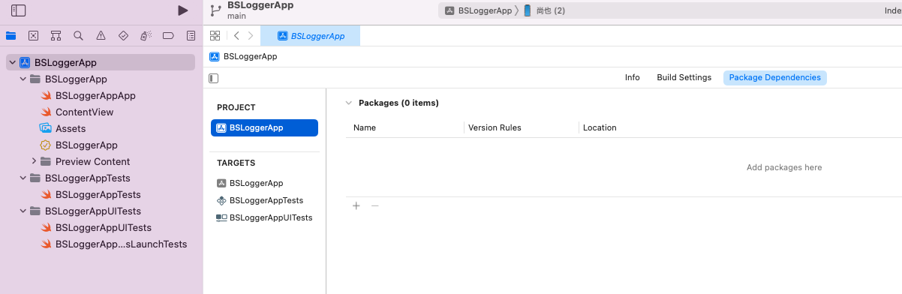
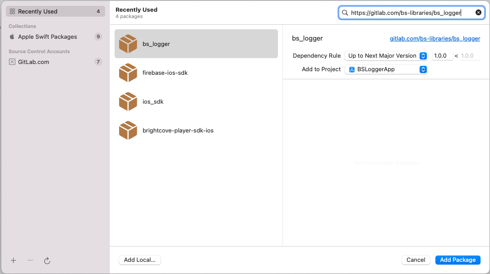
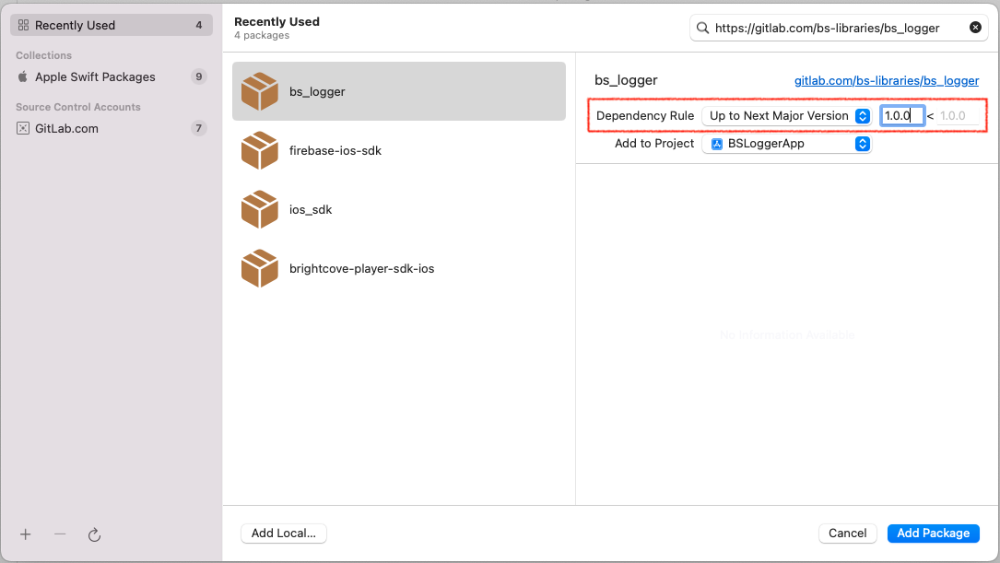
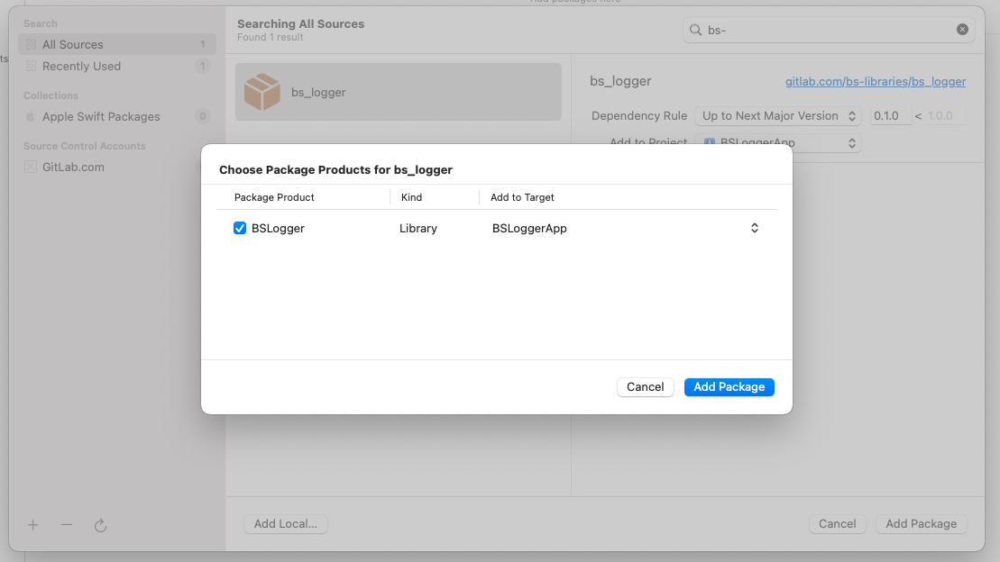
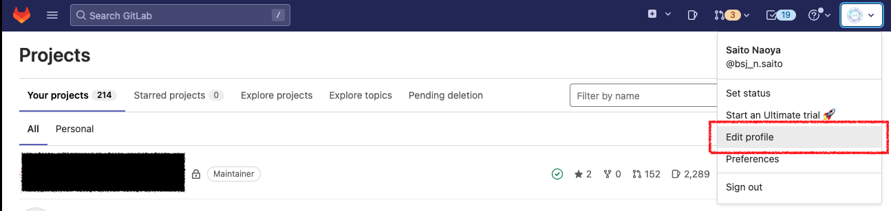
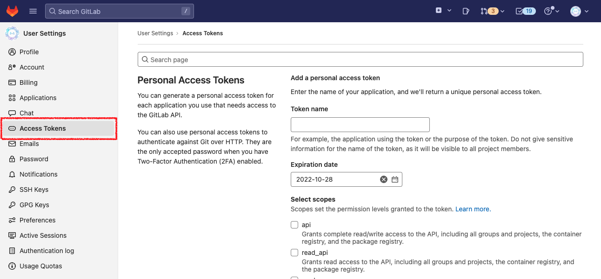
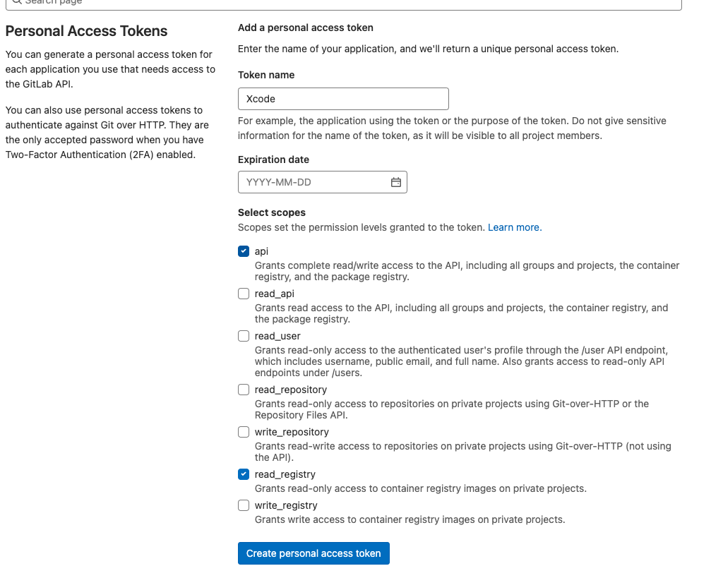
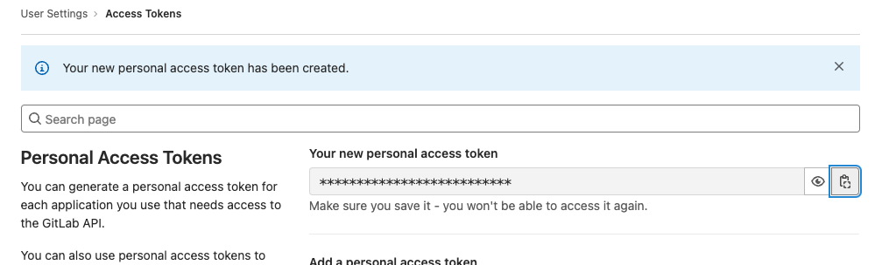
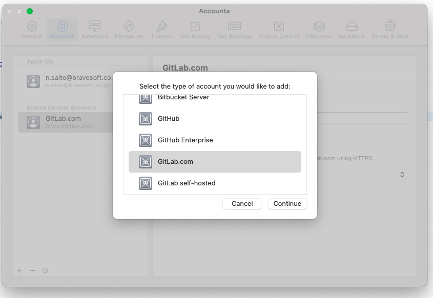

# BSLogger


<br><br>

[TOC]

## 概要
[bravesoft](https://www.bravesoft.co.jp/)が提供するシンプルにLog出力が可能なライブラリです。

## インストール方法
このライブラリはSwift Package Manager(以下、SPMとする)を使って導入することが可能です。  
ただし、このライブラリはbravesoftグループでのみ展開をおこなっているためプライベートリポジトリになっています。SPMでの導入後、[以下の設定](#private-setting)を行なってください。

### Swift Package Manager
#### 要件
- Xcode 14.0.0以降が必要です。
- サポートしているプラットフォームとバージョンは、[Package.swift](./Package.swift)を参照してください。
#### インストール
##### Xcodeからインストール
導入したいProjectを選択し、`Package Dependencies`タブの左下にある`+`ボタンを押下します。



---

右上の検索窓にリポジトリのURLを入力して、`bs_logger`を検索します。
```console
https://gitlab.com/bs-libraries/bs_logger
```


---

次に`Dependecy Rule`に`Up to Next Manager Version`、最低バージョンに`1.0.0`を指定して、ダイアログ右下の`Add Package`ボタンを押下します。



---

`BSLogger`を選択したままの状態で`Add Package`ボタンを押下してライブラリをインストールします。




### <a name="private-setting"></a>プライベートリポジトリの設定
※社外公開する時に削除。

プライベートリポジトリのライブラリをプロジェクトに導入する場合は、以下の設定を順に行なってください。

#### 1. SSH/Configファイルの設定
macOS上にある`~/.ssh/Config`ファイルに以下の情報を追記してください。また、IdentityFileのPathは自身がGitLabに登録したsshキーの秘密鍵のパスを記述してください。

```
Host gitlab.com.workteam
  HostName gitlab.com
  User git
  IdentityFile  ~/.ssh/id_rsa
  UseKeychain yes
  AddKeysToAgent yes
  PreferredAuthentications publickey
 
Host gitlab.com.hobby
  HostName gitlab.com
  User git
  IdentityFile  ~/.ssh/id_rsa
  UseKeychain yes
  AddKeysToAgent yes
  PreferredAuthentications publickey
```

#### 2. GitLabアクセストークンの発行
[GitLab](https://gitlab.com/)にログインしてください。

次に、右上の自身のアイコンから`Edit profile`をクリックして、`UserSettings`ページへ遷移してください。



---

サイドメニューから`Access Tokens`をクリックして`Personal Access Tokens`ページへ遷移してください。



---

トークンに適当な名前を付けたのち、権限一覧より`api`と`read_registry`にチェックを付け`Create personal access token`ボタンをクリックしてアクセストークンを発行してください。(期限は必要であれば付けてください)



---

トークンが発行されたら画面上に`Your new personal access token`という枠でトークンが表示されるので、クリップボードにコピーしておきましょう。(※トークンは一度しか表示されませんのでご注意ください)




#### 3. XcodeでGitLabにログイン
メニューバーの「Xcode」→「Preferences」をクリックしてXcodeの設定画面を表示します。


---

「Accounts」タブを開いて画面左下の「+」ボタンを押下して、`GitLab.com`を選択します。



表示されたフォームにGitLabアカウント名と2で生成したGitLabのアクセストークンを設定して、プライベートリポジトリへのアクセスは完了となります。
## 使い方
### 初期化
アプリ起動時処理に以下を追加してください。
「DEBUG・STAGING・RELESE」などのSchemeはプロジェクトで設定したスキーム名で記述してください。
```swift
class AppDelegate : UIResponder, UIApplicationDelegate {
    func application(_application: UIApplication, 
    didFinishLaunchingWithOptions launchOptions: [UIApplication.LaunchOptionsKey : Any]?) -> Bool {
        
        #if DEBUG
          BSLogger.shared.startRun(environment: .develop)
        #elseif STAGING
          BSLogger.shared.startRun(environment: .staging)
        #else //RELEASE
          BSLogger.shared.startRun(environment: .production)
        #endif
        
        return true
    }
}
```

### ログ出力
ログレベルに応じてメソッドを切り替えて使用してください。
#### ログ出力一覧
|レベル|通常ログ出力|変数ログ出力|
|----|----|----|
|debug|`BSLogger.debug(Any)`|`hoge.log(level: .debug)`|
|info|`BSLogger.info(Any)`|`hoge.log(level: .info)`|
|warn|`BSLogger.warn(Any)`|`hoge.log(level: .warn)`|
|error|`BSLogger.error(Any)`|`hoge.log(level: .error)`|

#### ログ出力サンプル
通常のログ出力のサンプルです。
```swift
import BSLogger

actor MainViewModel: ObservableObject {
    func onTapButton() {
        BSLogger.debug("Button was tapped.")
        BSLogger.debug("Hello, world.", 1)
    }
}
```
出力結果 >
```console
[DEBUG] MainViewModel.onTapButton() #5: Button was tapped.
[DEBUG] MainViewModel.onTapButton() #6: Hello, world
[DEBUG] MainViewModel.onTapButton() #6: 1
```

---

変数を直接ログ出力する場合のサンプルです。
```swift
import BSLogger

actor MainViewModel: ObservableObject {
    func onTapButton() {
        let text = "Button was tapped."

        text.log(level: .warn)
    }
}
```
出力結果 >
```console
[WARN] MainViewModel.onTapButton() #7: Button was tapped.
```

#### 変数ログ出力でサポートされている型一覧
##### プリミティブ型
- String
- Int
- Double
- Float
- Bool
- Dictionary
- Array
- Date
- Error
- Int64
- UInt
- NSDictionary
- NSArray
##### UIKit
- CGFloat
- CGPoint
- CGSize
- CGRect
- CGAffineTransform
- UIEdgeInsets

### 実行速度計測
処理の実行速度を計測したい時に簡単に使えるメソッドを用意しています。

```swift
import BSLogger

BSLogger.timeCheck(key: "Time") {
    Thread.sleep(forTimeInterval: 5.0)
}
```

また最低OSにiOS13以上が指定されているプロジェクトでは`async/await`をサポートしたメソッドが利用可能です。
```swift
import BSLogger

BSLogger.timeCheck(key: "AsyncTime", task: .main) {
    try? await Task.sleep(nanoseconds: 500000)
}
```

### Deinitログ出力
オブジェクト破棄時の自動ログ出力が可能です。

ログ出力を有効化するためには`BSDeinitLogger`を継承してください。

```swift
class Hoge: BSDeinitLogger {
}

var hoge: Hoge?
hoge = .init()
hoge = nil
```

出力結果 >
```console
[DEINIT] Hoge deinit
```

## デモアプリ
[デモアプリ](./Demo)
## ライセンス
※ 社外公開する時に記載。
