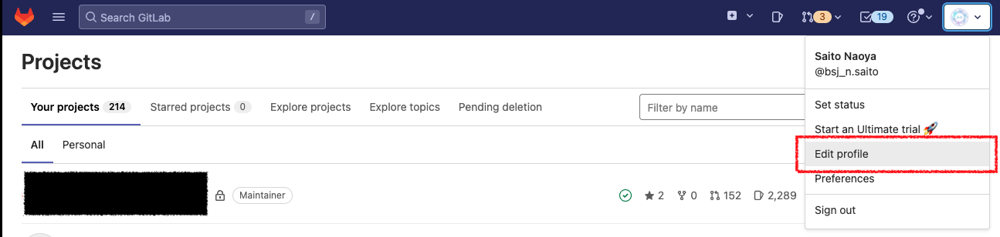
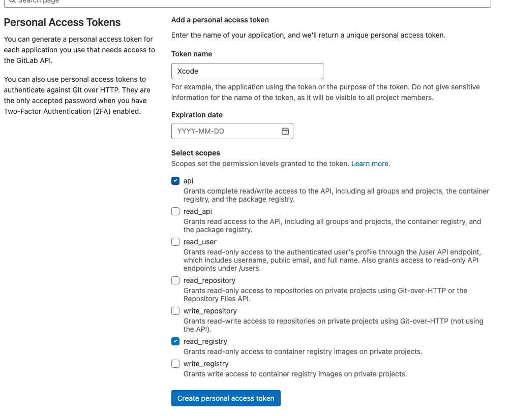
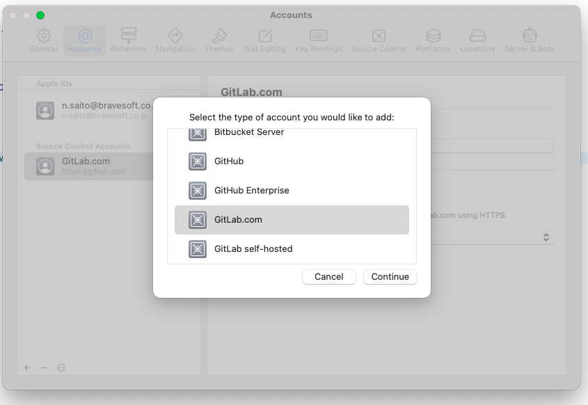

<br><br>

[日本語のREADMEはこちら](./README-ja.md)

# BSLogger
[bravesoft](https://www.bravesoft.co.jp/)が提供するシンプルにLog出力が可能なライブラリです。

## インストール方法
このライブラリはSwift Package Manager(以下、SPMとする)を使って導入することが可能です。  
ただし、このライブラリはbravesoftグループでのみ展開をおこなっているためプライベートリポジトリになっています。SPMでの導入後、[以下の設定](#private-setting)を行なってください。

### Swift Package Manager
#### 要件
- Xcode 14.0.0以降が必要です。
- サポートしているプラットフォームのバージョンは、[Package.swift](./Package.swift)を参照してください。
#### インストール
##### Xcodeからインストール
導入したいProjectを選択し、`Package Dependencies`タブの左下にある`+`ボタンを押下します。


---

右上の検索窓にリポジトリのURLを入力して、`bs_logger`を検索します。
```console
https://gitlab.com/bs-libraries/bs_logger
```


---

次に`Dependecy Rule`に`Up to Next Manager Version`、最低バージョンに`1.0.0`を指定して、ダイアログ右下の`Add Package`ボタンを押下します。


---

`BSLogger`を選択したままの状態で`Add Package`ボタンを押下してライブラリをインストールします。


### <a name="private-setting"></a>プライベートリポジトリの設定
プライベートリポジトリのライブラリをプロジェクトに導入する場合は、以下の設定を順に行なってください。

#### 1. SSH/Configファイルの設定
macOS上にある`~/.ssh/Config`ファイルに以下の情報を追記してください。また、IdentityFileのPathは自身がGitLabに登録したsshキーの秘密鍵のパスを記述してください。

```
Host gitlab.com.workteam
  HostName gitlab.com
  User git
  IdentityFile  ~/.ssh/id_rsa
  UseKeychain yes
  AddKeysToAgent yes
  PreferredAuthentications publickey
 
Host gitlab.com.hobby
  HostName gitlab.com
  User git
  IdentityFile  ~/.ssh/id_rsa
  UseKeychain yes
  AddKeysToAgent yes
  PreferredAuthentications publickey
```

#### 2. GitLabアクセストークンの発行
[GitLab](https://gitlab.com/)にログインしてください。

次に、右上の自身のアイコンから`Edit profile`をクリックして、`UserSettings`ページへ遷移してください。


---

サイドメニューから`Access Tokens`をクリックして`Personal Access Tokens`ページへ遷移してください。


---

トークンに適当な名前を付けたのち、権限一覧より`api`と`read_registry`にチェックを付け`Create personal access token`ボタンをクリックしてアクセストークンを発行してください。(期限は必要であれば付けてください)



---

トークンが発行されたら画面上に`Your new personal access token`という枠でトークンが表示されるので、クリップボードにコピーしておきましょう。(※トークンは一度しか表示されませんのでご注意ください)


#### 3. XcodeでGitLabにログイン
メニューバーの「Xcode」→「Preferences」をクリックしてXcodeの設定画面を表示します。


---

「Accounts」タブを開いて画面左下の「+」ボタンを押下して、`GitLab.com`を選択します。



表示されたフォームにGitLabアカウント名と2で生成したGitLabのアクセストークンを設定して、プライベートリポジトリへのアクセスは完了となります。
## 使い方

## ライセンス
※ 社外公開する時に記載。