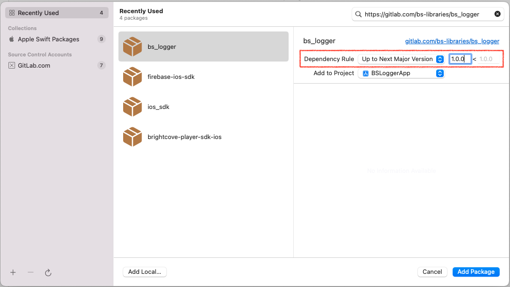
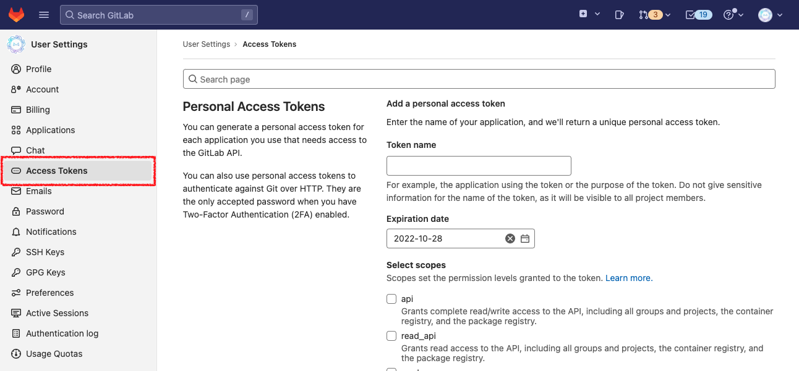
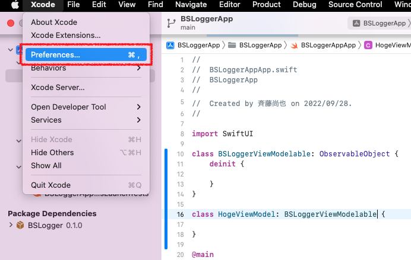

[日本語のREADMEはこちら](./README-ja.md)
# BSLogger


<br><br>

[TOC]

## Overview
This is a library which is provided by [bravesoft](https://www.bravesoft.co.jp/) to output log simply.

## Installation
This library is able to adapt into the project by using Swift Package Manager(SPM).
However, this library is a private repository due to only share to bravesoft group companies. SO, after adapting by SPM, apply [this settings](#private-setting).

### Swift Package Manager
#### Requirements
-  Xcode 14.0.0 or later versions
- Check [Package.swift](./Package.swift) for letting you know the supported versions and platforms.
#### Install
##### Install From Xcode
Choose the prpject that you want to adapt bs_logger and click `+` button at lower left of `Package Dependencies` tab.


---

Put repository URL at search window of upper right and search `bs_logger`
```console
https://gitlab.com/bs-libraries/bs_logger
```


---

Next Specify `Up to Next Manager Version` and `1.0.0` for lowest verion to `Dependecy Rule` and click `Add Package` button at lower right of dialog.



---

To install library, keep choosing `BSLogger` and click `Add Package` button.


### <a name="private-setting"></a>Settings of Private Repository
※Before open source,this shoud be deleted

There is the way of settings for adapting private repository's library into project at down below.

#### 1. SSH/Config File's Settings
Postscript the information of down below at `~/.ssh/Config` file on macOS. In addtion to this, you need to write ssh Key's secretKey path which is registered by yourself at GitLab for IdentityFile's path.

```
Host gitlab.com.workteam
  HostName gitlab.com
  User git
  IdentityFile  ~/.ssh/id_rsa
  UseKeychain yes
  AddKeysToAgent yes
  PreferredAuthentications publickey
 
Host gitlab.com.hobby
  HostName gitlab.com
  User git
  IdentityFile  ~/.ssh/id_rsa
  UseKeychain yes
  AddKeysToAgent yes
  PreferredAuthentications publickey
```

#### 2. Issue GitLab's Access Token
Login [GitLab](https://gitlab.com/)

Next, click yourown icon at upper right and click `Edit profile`, then move to `UserSettings` page.


---

Click `Access Tokens` from side menu and move to `Personal Access Tokens` page



---

After name token, put a check `api` and `read_registry` from authorization lists, and click `Create personal access token` button to issue access token. (set Expiration date if necessary)


---

After issuing token, `Your new personal access token` frame is displaying, copy to clipboard(※Token is displaying only one time.)


#### 3. Login to GitLab on Xcode
Display Xcode setting screen by clicking 'Xcode' → 'Preferences' at menu bar.



---

Open 'Accounts' Tab and click '+' at lower left of screeen, then choose `GitLab.com`.


Put account name of GitLab and GitLab access token which you got at 2 to the form showing on display then your process to access private repository is completed.
## Usage
### Initialization
Add the information down below when the app is started doing start-up process.
Schemes like 'DEBUG・STAGING・RELESE' should be written by Scheme name of being setted at project.

```swift
class AppDelegate : UIResponder, UIApplicationDelegate {
    func application(_application: UIApplication, 
    didFinishLaunchingWithOptions launchOptions: [UIApplication.LaunchOptionsKey : Any]?) -> Bool {
        
        #if DEBUG
          BSLogger.shared.startRun(environment: .develop)
        #elseif STAGING
          BSLogger.shared.startRun(environment: .staging)
        #else //RELEASE
          BSLogger.shared.startRun(environment: .production)
        #endif
        
        return true
    }
}
```

### Log Output
Use this function by switching methods as log level.
#### Log Output List
|Level|General Log Output|Variable Log Output|
|----|----|----|
|debug|`BSLogger.debug(Any)`|`hoge.log(level: .debug)`|
|info|`BSLogger.info(Any)`|`hoge.log(level: .info)`|
|warn|`BSLogger.warn(Any)`|`hoge.log(level: .warn)`|
|error|`BSLogger.error(Any)`|`hoge.log(level: .error)`|

#### Log Output sample
Here is a sample of General log output.
```swift
import BSLogger

actor MainViewModel: ObservableObject {
    func onTapButton() {
        BSLogger.debug("Button was tapped.")
        BSLogger.debug("Hello, world.", 1)
    }
}
```
Output result >
```console
[DEBUG] MainViewModel.onTapButton() #5: Button was tapped.
[DEBUG] MainViewModel.onTapButton() #6: Hello, world
[DEBUG] MainViewModel.onTapButton() #6: 1
```

---

Here is a sample of Directory doing log output.

```swift
import BSLogger

actor MainViewModel: ObservableObject {
    func onTapButton() {
        let text = "Button was tapped."

        text.log(level: .warn)
    }
}
```
Output result >
```console
[WARN] MainViewModel.onTapButton() #7: Button was tapped.
```

#### List of supported data type for Variable Log Output
##### Primitive data type
- String
- Int
- Double
- Float
- Bool
- Dictionary
- Array
- Date
- Error
- Int64
- UInt
- NSDictionary
- NSArray
##### UIKit
- CGFloat
- CGPoint
- CGSize
- CGRect
- CGAffineTransform
- UIEdgeInsets

### Measure The Processing Speed
We provite easy methods to use for the time when you want to measure the processing sepeed.

```swift
import BSLogger

BSLogger.timeCheck(key: "Time") {
    Thread.sleep(forTimeInterval: 5.0)
}
```

In Additon to above, you can use `async/await` supported methods if the project specifies iOS 13 or later for lowest OS.
```swift
import BSLogger

BSLogger.timeCheck(key: "AsyncTime", task: .main) {
    try? await Task.sleep(nanoseconds: 500000)
}
```

### Deinit Log OutPut
We provite methods for when destroying an object.

```swift
import BSLogger

class Hoge {
    deinit {
        BSLogger.deinit()
    }
}
```
Output result >
```console
[DEINIT] Hoge deinit
```

## Demo 
[Demo](./Demo)
## License
※When open source, we add License information here.
